# Hướng Dẫn Vẽ Lại Use Case Diagram

> Hướng dẫn này cho người **đang vẽ Use Case Diagram** của project Publication Trend System. Đọc xong là vẽ được không cần hỏi ai.

---

## 🎯 Mục Đích

Use Case Diagram hiện tại đã có ý tưởng tốt (capture AI integration, dùng `<<include>>` `<<extend>>` đúng) **nhưng còn thiếu** ~75% use cases và **gán nhầm vài actor**. Doc này list đầy đủ những gì cần có.

## 📐 Bước 0: Chuẩn Bị

- Tool đề xuất: **draw.io** (https://app.diagrams.net/) hoặc **Lucidchart** hoặc **Star UML**
- Notation: UML 2.5 chuẩn (actor stick figure, ellipse cho use case, đường thẳng cho association, mũi tên đứt cho `<<include>>` / `<<extend>>`)
- Khổ giấy: A3 ngang (đủ chỗ cho ~40 use cases)

---

## 👤 Bước 1: Vẽ 5 Actors

### 4 Human Actors (bên trái)

```
Student        — sinh viên (role thấp nhất, search + bookmark)
   ▲
   │ <<extends>>            ← generalization (mũi tên rỗng)
   │
Lecturer       — giảng viên (như student + tạo projects)
   ▲
   │ <<extends>>
   │
Researcher     — nghiên cứu sinh (full features + AI reports)
```

```
Admin          — quản trị viên (riêng, không thừa kế User)
```

### 1 System Actor (bên phải)

```
AI Agent       — hệ thống AI (Gemini + RAG + MCP)
Subsystem        — tự động làm các việc khi được trigger
```

**Quy ước vẽ:**
- 3 Human actors **bên trái** (Student/Lecturer/Researcher xếp dọc, có mũi tên rỗng nối)
- 1 Admin **bên trái dưới cùng** (KHÔNG nối với 3 cái trên)
- 1 AI Agent **bên phải** (system actor)

### Vì sao có generalization giữa Student → Lecturer → Researcher

Vì **Researcher kế thừa quyền của Lecturer**, **Lecturer kế thừa quyền của Student**:
- Student làm được X, Y, Z
- Lecturer làm được X, Y, Z **+ Create Project**
- Researcher làm được X, Y, Z + Create Project **+ Generate Report + Research Gap**

→ Trong diagram, **chỉ cần nối Researcher với "Generate Report"**, không cần nối lại với "Search Papers" (vì đã thừa kế từ Student qua generalization).

---

## 📦 Bước 2: Tổ Chức Use Cases Theo 6 Packages

Mỗi package là 1 hình chữ nhật chứa các use cases liên quan. Giúp diagram đỡ rối.

### Package 1: Authentication 🔐

```
┌─ Package: Authentication ────────────────────────────┐
│                                                      │
│   ⬭ Register Account                                 │
│   ⬭ Login                                            │
│   ⬭ Logout                                           │
│   ⬭ Refresh Session                                  │
│   ⬭ Manage Profile                                   │
│                                                      │
└──────────────────────────────────────────────────────┘
```

**Actors liên kết:**
- Student → Register, Login, Logout, Manage Profile
- (Lecturer, Researcher thừa kế qua generalization)
- Admin → Login, Logout, Manage Profile (KHÔNG cần Register vì admin được tạo sẵn)

### Package 2: Discovery 🔍

```
┌─ Package: Discovery ─────────────────────────────────┐
│                                                      │
│   ⬭ Search Research Papers                           │
│        ←─ <<extend>> ─── Keyword Search              │
│        ←─ <<extend>> ─── Semantic Search             │
│                                                      │
│   ⬭ View Paper Detail                                │
│        ─── <<include>> ──→ View References           │
│        ─── <<include>> ──→ View Similar Papers       │
│        ─── <<include>> ──→ View AI Score             │
│                                                      │
│   ⬭ View Trend Dashboard                             │
│        ─── <<include>> ──→ Render Statistical Charts │
│                                                      │
│   ⬭ Browse Journals / Authors                        │
│                                                      │
└──────────────────────────────────────────────────────┘
```

**Actors liên kết:** Student (tất cả use case trong package này)

### Package 3: Personalization ⭐

```
┌─ Package: Personalization ───────────────────────────┐
│                                                      │
│   ⬭ Bookmark Paper / Keyword / Topic                 │
│   ⬭ Follow Topic / Author / Journal                  │
│   ⬭ Save Search Query                                │
│   ⬭ Receive Notifications                            │
│   ⬭ Mark Notification as Read                        │
│                                                      │
└──────────────────────────────────────────────────────┘
```

**Actors liên kết:** Student (cả package)

### Package 4: Research Project 📑

```
┌─ Package: Research Project (Lecturer+) ──────────────┐
│                                                      │
│   ⬭ Create Research Project                          │
│   ⬭ Add Papers to Project                            │
│   ⬭ Invite Project Members                           │
│   ⬭ Manage Project                                   │
│   ⬭ View Project Papers                              │
│                                                      │
└──────────────────────────────────────────────────────┘
```

**Actors liên kết:** Lecturer (cả package — Student KHÔNG có quyền tạo project)

### Package 5: AI Reports & Insights 🤖

```
┌─ Package: AI Reports (Researcher+) ──────────────────┐
│                                                      │
│   ⬭ Request Trend Analysis Report                    │
│        ─── <<include>> ──→ Retrieve RAG Context      │
│        ─── <<include>> ──→ Score & Rank Paper        │
│        ─── <<include>> ──→ Verify AI Report          │
│                                                      │
│   ⬭ View Report List                                 │
│   ⬭ Analyze Research Gaps                            │
│   ⬭ Export Report (PDF / Markdown)                   │
│                                                      │
│   ⬭ Evaluate Uploaded Paper                          │
│        ←─ <<extend>> ─── Input DOI                   │
│        ←─ <<extend>> ─── Paste Abstract              │
│        ←─ <<extend>> ─── Upload PDF                  │
│                                                      │
└──────────────────────────────────────────────────────┘
```

**Actors liên kết:** Researcher (cả package — Lecturer KHÔNG có Research Gap)

### Package 6: Administration ⚙️

```
┌─ Package: Administration (Admin only) ───────────────┐
│                                                      │
│   ⬭ Manage Users (assign role, deactivate)           │
│                                                      │
│   ⬭ Configure Data Sources                           │
│   ⬭ Synchronize Data from Academic APIs              │
│        ─── <<include>> ──→ Parse Metadata            │
│        ─── <<include>> ──→ Update Trend Database     │
│                                                      │
│   ⬭ View Sync Runs History                           │
│   ⬭ View Audit Logs                                  │
│   ⬭ Configure AI Models                              │
│   ⬭ Manage Prompt Templates                          │
│                                                      │
└──────────────────────────────────────────────────────┘
```

**Actors liên kết:** Admin (cả package — và CHỈ Admin)

### Package 7: AI Subsystem (System Boundary) 🧠

```
┌─ Package: AI Subsystem (auto-triggered) ─────────────┐
│                                                      │
│   ⬭ Generate Embedding for Paper                     │
│   ⬭ Compute Paper Quality Check                      │
│   ⬭ Score & Rank Paper Relevance                     │
│   ⬭ Execute MCP Tool Call                            │
│   ⬭ Generate Analytical Report (via RAG)             │
│   ⬭ Identify Research Gaps                           │
│                                                      │
└──────────────────────────────────────────────────────┘
```

**Actors liên kết:** AI Agent Subsystem (cả package)

**Cách kết nối với use cases ở packages khác:**
- "Request Trend Analysis Report" (User) ─── triggers ──→ "Generate Analytical Report" (AI)
- "Synchronize Data" (Admin) ─── triggers ──→ "Generate Embedding for Paper" (AI)

---

## 🔗 Bước 3: Vẽ Relationships

### Loại 1: Association (đường thẳng đơn)

Actor → Use Case (actor làm use case đó):
```
Student ────── Search Research Papers
```

### Loại 2: `<<include>>` (mũi tên đứt nét, có chữ trong dấu << >>)

Use case A bắt buộc dùng use case B:
```
Request Report ────────────────→ Retrieve RAG Context
              <<include>>
```

Dùng khi: B là phần bắt buộc của A. Không có B thì A không xong được.

### Loại 3: `<<extend>>` (mũi tên đứt nét, ngược chiều)

Use case B mở rộng use case A trong điều kiện nhất định:
```
Search Papers ←──────────────── Semantic Search
              <<extend>>
```

Dùng khi: B là 1 cách optional để thực hiện A.

### Loại 4: Generalization (mũi tên rỗng nét liền)

Actor B là 1 dạng cụ thể của actor A:
```
Researcher ─────▷ User
          (mũi tên rỗng đặc, tam giác)
```

---

## 📋 Bước 4: Checklist Khi Vẽ Xong

Đối chiếu diagram của bạn với checklist này:

### Actors (5 cái)
- [ ] Student (left)
- [ ] Lecturer (left, có generalization → Student)
- [ ] Researcher (left, có generalization → Lecturer)
- [ ] Admin (left dưới, KHÔNG có generalization)
- [ ] AI Agent Subsystem (right)

### Tổng số use cases tối thiểu
- [ ] Package Authentication: 5 use cases
- [ ] Package Discovery: 4 use cases chính (+ 5 include/extend)
- [ ] Package Personalization: 5 use cases
- [ ] Package Research Project: 5 use cases
- [ ] Package AI Reports: 4 use cases chính (+ 6 include/extend)
- [ ] Package Administration: 6 use cases (+ 2 include)
- [ ] Package AI Subsystem: 6 use cases

→ **Tổng ~35-40 use cases** (bao gồm include/extend)

### Relationships
- [ ] 3 generalizations giữa Student / Lecturer / Researcher
- [ ] Ít nhất 8 `<<include>>` (Search, Report, Sync, View Detail...)
- [ ] Ít nhất 5 `<<extend>>` (Keyword/Semantic Search, Input DOI/Paste/Upload...)
- [ ] Mỗi actor có ít nhất 3 association tới use case
- [ ] Admin KHÔNG nối với use cases ngoài Package Administration

---

## ⚠️ 5 Lỗi Phổ Biến Phải Tránh

### Lỗi 1: Admin làm việc của user thường
```
❌ Admin ─── Search Papers
❌ Admin ─── Request Report

✅ Admin CHỈ làm: Manage Users, Configure Data Sources,
                  Sync Data, View Audit Logs, etc.
```

### Lỗi 2: Quên generalization, nên phải nối lại cùng use case cho 3 role
```
❌ Student ─── Search Papers
   Lecturer ─── Search Papers     (lặp lại)
   Researcher ─── Search Papers   (lặp lại)

✅ Student ─── Search Papers
   Lecturer ──▷ Student           (generalization)
   Researcher ──▷ Lecturer        (generalization)

   → Lecturer và Researcher TỰ ĐỘNG có quyền Search Papers
```

### Lỗi 3: Nhầm `<<include>>` với `<<extend>>`
```
✅ <<include>> dùng khi B BẮT BUỘC:
   Request Report ─→ Retrieve RAG Context

✅ <<extend>> dùng khi B OPTIONAL:
   Search ←─ Semantic Search (có thể search keyword thay vì semantic)
```

### Lỗi 4: AI Agent không phải là user
```
❌ Vẽ AI Agent giống stick figure như User

✅ Vẽ AI Agent là "system actor" — có thể dùng:
   - Stick figure với chú thích "<<system>>" hoặc "<<external>>"
   - Hoặc hình vuông có chữ "AI Agent Subsystem"
```

### Lỗi 5: Use case quá generic hoặc quá chi tiết
```
❌ Quá generic: "Use System"
❌ Quá chi tiết: "Click Submit Button"

✅ Vừa phải: "Search Research Papers", "Generate Report"
   → 1 câu mô tả goal, không phải step-by-step
```

---

## 💻 Bước 5: Reference Code (Mermaid)

Nếu bạn dùng draw.io, có thể paste code này vào để kiểm tra (Extras → Edit Diagram → Insert from text):

```mermaid
flowchart TB
    %% Actors
    Student((Student))
    Lecturer((Lecturer))
    Researcher((Researcher))
    Admin((Admin))
    AIAgent((AI Agent<br/>Subsystem))

    %% Generalization
    Lecturer -.extends.-> Student
    Researcher -.extends.-> Lecturer

    %% Use cases - Authentication
    UC_Register[Register]
    UC_Login[Login]
    UC_Logout[Logout]
    UC_Profile[Manage Profile]

    Student --- UC_Register
    Student --- UC_Login
    Student --- UC_Logout
    Student --- UC_Profile
    Admin --- UC_Login
    Admin --- UC_Profile

    %% Use cases - Discovery
    UC_Search[Search Research Papers]
    UC_Keyword[Keyword Search]
    UC_Semantic[Semantic Search via Embeddings]
    UC_PaperDetail[View Paper Detail]
    UC_Trend[View Trend Dashboard]
    UC_Charts[Render Statistical Charts]

    Student --- UC_Search
    Student --- UC_PaperDetail
    Student --- UC_Trend

    UC_Keyword -.extends.-> UC_Search
    UC_Semantic -.extends.-> UC_Search
    UC_Trend -.includes.-> UC_Charts

    %% Use cases - Research Projects (Lecturer+)
    UC_CreateProject[Create Research Project]
    UC_AddPapers[Add Papers to Project]
    UC_Invite[Invite Project Members]

    Lecturer --- UC_CreateProject
    Lecturer --- UC_AddPapers
    Lecturer --- UC_Invite

    %% Use cases - AI Reports (Researcher+)
    UC_RequestReport[Request Trend Analysis Report]
    UC_RAG[Retrieve RAG Context]
    UC_Score[Score and Rank Paper]
    UC_Verify[Verify AI Report]
    UC_Gap[Analyze Research Gaps]
    UC_Evaluate[Evaluate Uploaded Paper]
    UC_DOI[Input DOI]
    UC_Abstract[Paste Abstract]
    UC_PDF[Upload PDF]

    Researcher --- UC_RequestReport
    Researcher --- UC_Gap
    Researcher --- UC_Evaluate

    UC_RequestReport -.includes.-> UC_RAG
    UC_RequestReport -.includes.-> UC_Score
    UC_RequestReport -.includes.-> UC_Verify

    UC_DOI -.extends.-> UC_Evaluate
    UC_Abstract -.extends.-> UC_Evaluate
    UC_PDF -.extends.-> UC_Evaluate

    %% Use cases - Personalization
    UC_Bookmark[Bookmark Paper]
    UC_Follow[Follow Topic]
    UC_Notify[Receive Notifications]
    UC_SaveSearch[Save Search Query]

    Student --- UC_Bookmark
    Student --- UC_Follow
    Student --- UC_Notify
    Student --- UC_SaveSearch

    %% Use cases - Administration
    UC_ManageUsers[Manage Users]
    UC_ConfigSources[Configure Data Sources]
    UC_Sync[Synchronize Data from APIs]
    UC_Parse[Parse Metadata]
    UC_UpdateTrend[Update Trend Database]
    UC_SyncHistory[View Sync Runs History]
    UC_Audit[View Audit Logs]

    Admin --- UC_ManageUsers
    Admin --- UC_ConfigSources
    Admin --- UC_Sync
    Admin --- UC_SyncHistory
    Admin --- UC_Audit

    UC_Sync -.includes.-> UC_Parse
    UC_Sync -.includes.-> UC_UpdateTrend

    %% Use cases - AI Subsystem
    UC_GenEmbed[Generate Embedding]
    UC_QualityCheck[Compute Quality Check]
    UC_AIScore[Score Paper Relevance]
    UC_MCPCall[Execute MCP Tool Call]
    UC_GenReport[Generate Analytical Report]
    UC_GenGap[Identify Research Gaps]

    AIAgent --- UC_GenEmbed
    AIAgent --- UC_QualityCheck
    AIAgent --- UC_AIScore
    AIAgent --- UC_MCPCall
    AIAgent --- UC_GenReport
    AIAgent --- UC_GenGap
```



---

## 🎁 Bonus: Specification Cho Use Case Quan Trọng

Khi viết doc nộp thầy, mỗi use case cần có spec sau (template):

```
Use Case: Request Trend Analysis Report
─────────────────────────────────────────────────────────
Actor:               Researcher (primary), AI Agent (system)
Pre-condition:       User logged in, user.role = "researcher"
                     Database has ≥ 50 papers for the queried topic

Main Flow:
1. Researcher chọn topic + filter (year range, journals)
2. Researcher click "Generate Report"
3. System tạo rag_query record
4. System retrieves top-K papers (include: Retrieve RAG Context)
5. System gửi context + prompt cho LLM (Gemini 2.5 Pro)
6. LLM generates markdown report
7. System runs verification (include: Verify AI Report)
8. System saves llm_analysis_reports
9. System hiển thị report cho user

Extensions:
4a. Không đủ papers (< 10) → show warning, allow cancel
6a. LLM API timeout (> 30s) → retry once, then fail
7a. Verification fail → mark report as "low-confidence"

Post-condition:
  - llm_analysis_reports.status = "ready"
  - audit_logs ghi action "report.generated"
  - User có thể view + export report
```

→ Cần spec tương tự cho ~10 use case quan trọng (Search, View Detail, Sync Data, Generate Report, Analyze Gap, Create Project, Manage Users...).

---

## 📚 Tham Khảo Để Hiểu Thêm

- Schema database: [`CLAUDE.md`](../CLAUDE.md) §9 Data Model
- User roles + features: [`docs/PHASE_A_TEAM_TASKS.md`](PHASE_A_TEAM_TASKS.md) — phần 4 User Journeys
- AI flow chi tiết: [`docs/superpowers/specs/2026-05-25-phase-a-design.md`](superpowers/specs/2026-05-25-phase-a-design.md)
- UML 2.5 spec (tiếng Anh): https://www.uml-diagrams.org/use-case-diagrams.html

---

## ✅ Khi Vẽ Xong, Self-Review

Kiểm tra 3 câu hỏi:

1. **Mỗi actor có hợp lý không?** Admin không làm search, Student không tạo project, Researcher không config sync. → Đúng phân quyền.
2. **Có generalization giữa 3 user roles không?** Nếu mỗi role lặp lại các use case giống nhau → SAI, cần dùng generalization.
3. **AI Agent có vai trò rõ ràng không?** AI là **system actor** auto-triggered bởi user actions, không phải user.

Nếu trả lời ✅ cho cả 3 → Diagram đã đúng. Export thành PNG/PDF và submit.
